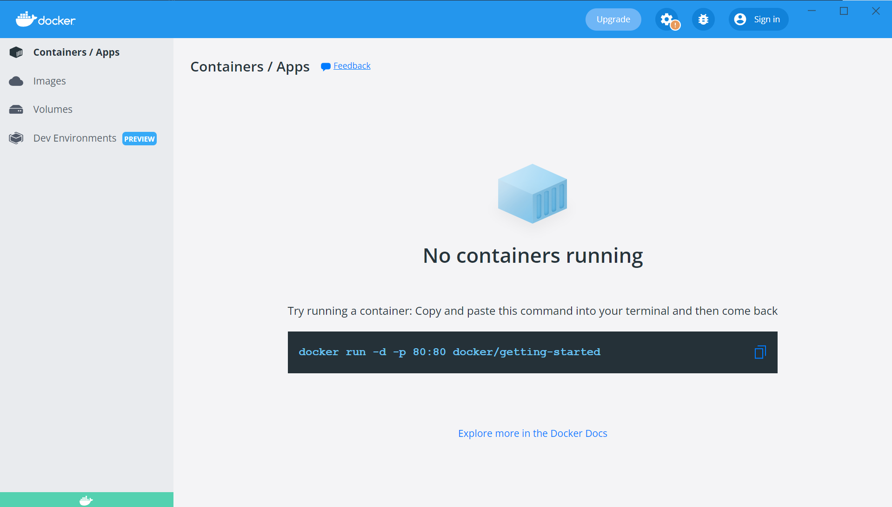
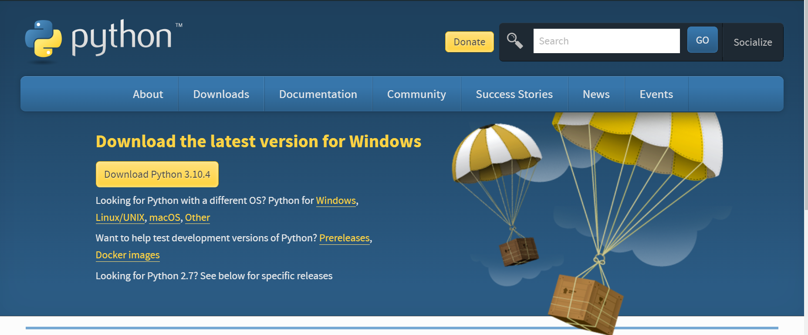

# D.U.N.E.
Docker Utilities for Node Execution


## Getting Started
First we must install [Docker](https://docs.docker.com/get-docker/).


Once you select the Docker Desktop for your operating system the installation process is very straight forward.

## `Linux`
They have both .DEB and .RPM packages available.  If you can't get these to work for some reason most repos have packages available for the engine and auxillary components.

When finished installing. Check the installation with the command 
```console
$ docker --help
```

This should display the list of commands and features.  If it fails with unknown command the installation did not work correctly.

### `Python3`
Depending on the distro you are using will determine which python3 package to install.

| Distro | Package Name |
|--------|--------------|
| Ubuntu | python3 |
| RHEL   | rh-python36 * (need to use `scl enable rh-python36 bash`)| 
| Centos | python3 |
| Arch   | python |


### `Add DUNE To Path`
To keep from having to install files to the users system, the perferred method of usage is to add this directory to your 'PATH'.
```console
$ echo "PATH=<LocationOfDUNE>:$PATH" >> .bashrc
```

Pick your preferred terminal application and input the following command:

```console
<PathToDUNE>/DUNE$ ./bootstrap.sh
```
## `Windows 10 & 11`
You might need to turn on hardware virtualization in the BIOS of your computer.  Docker should give an error stating this failure.
Because of the variance of motherboards and BIOS implementations we can't give a clear description as to how to turn this on, but a quick google search with your PC make and model should find the information you would need.

You can then start the program `Docker Desktop`

You should see the following:


### `Python3`
To install Python3 on Windows is pretty straightforward.

Go to [Python3](https://python.org/downloads)
You should see the link for Python 3.10.4:


### `Add DUNE To Path`
To keep from having to install files to the users system, the perferred method of usage is to add this directory to your 'PATH'.
Goto to Start Search and type `edit the system` and choose `Edit the system enviroment variables`


From here you should click on the button marked `Environment Variables`


From here select the line with `Path` and select `Edit...`


From here add a new line with the location of the downloaded DUNE project:


Pick your preferred command line application and input the following command:
```console:
C:\<PathToDUNE>\DUNE$ .\bootstrap.bat
```

## `DUNE Commands`
---
### -h, --help
---
This will display the available commands and a small description of each and argument values.

---
### --start
---
This will start a new node for deploying smart contracts and send actions against
This command takes a name of your choosing and an optional `config.ini` (look at scripts/config.ini for reference).

---
### --stop
---
This will stop a node that is running.
This command takes a name of a node that was previously started.

---
### --remove
---
This will remove a node from the system.
This command takes a name of a node that was previously started.

---
### --list
---
This will print the status of all nodes currently in the system.
It will display if the node is active, running, and the ports for http/p2p/SHiP.

---
### --simple-list
---
Does the same thing as `--list` but does not use unicode and other formatting for use with scripts or plugins.

---
### --set-active
---
This will set a node as the current active node.
This command takes a name of a node that was previously started.

---
### --get-active
---
This will return the name of the currently active node.

---
### --export-node
---
This will create a snapshot and tar ball the state snapshot, blocklog and index and export to desired location.
This command takes a name of a node that was previously started, and a directory to save the exported node contents.

---
### --import-node
---
This will import a previously exported node.tgz.
This command takes the path of the export and the name of what you want to name the imported node.

---
### --monitor
---
This will return information from the currently active node.

---
### --import-dev-key
---
This will import a private key into the precreated developer wallet.
This command takes a private key.

---
### --create-key
---
This will produce a public key and private key pair for development uses.

---
### --create-account
---
This will create a new 'on chain' account.
This command takes an `EOSIO` compatible name an optional Creator (also a valid `EOSIO` name).

---
### --create-cmake-app
---
This will produce a new smart contract project that utilizes CMake as its build system.
This command takes a project name and a directory.

---
### --create-bare-app
---
This will produce a new smart contract project that is bare, i.e. uses only `cdt-cpp` tools.
This command takes a project name and a directory.

---
### --cmake-build
---
This will build a given cmake app project.
This command takes a directory to the project and optional CMake flags.

---
### --other-build
---
This will build a given app project.
This command takes a directory to the project, a command and an optional set of flags to that command.

---
### --destroy-container
---
This will destroy and remove the currently running container.  WARNING! This will delete all data that is running.
This is useful if you need to update to a new version of DUNE or if you corrupt the container some how.

---
### --stop-container
---
This will stop the currently running container.

---
### --start-container
---
This will start the `dune` container.

---
### --set-system-contract
---
This will deploy the system contract to an account.
This command takes a valid `EOSIO` name.

---
### --set-bios-contract
---
This will deploy the bios contract to an account.
This command takes a valid `EOSIO` name.

---
### --set-token-contract
---
This will deploy the token contract to an account.
This command takes a valid `EOSIO` name.


---
### --bootstrap-system
---
This will install the boot contract to `eosio` and activate all protocol features.

---
### --bootstrap-system-full
---
This will install the boot contract to `eosio` and activate all protocol features.  It will also create all accounts needed for `mandel.contracts` and deploy the system, token and msig contract.

---
### --send-action
---
This will send an action to an account.
This command takes an valid `EOSIO` account name, a valid `EOSIO` action name, the data payload needed and the permission.

---
### --activate-feature
---
This will activate a protocol feature.
This command takes a code name for the protocol feature.

---
### --list-features
---
This will list the available protocol feature code names.

---
### -- (Not listed with -h)
This will allow you to call the tool and pass through to the underlying system.
---

## `Concepts and Operations`
The core concept of this utility is to abstract over `nodeos`, `cleos`, `CDT`, etc.
As such some of the commands might seem restrictive.  Please take note that if you find any of the commands to be too
restrictive then you can use the command `--` followed by whatever normal `cleos`, `nodeos`, `CDT` and `OS` commands
## Scenarios
### Contract Development
