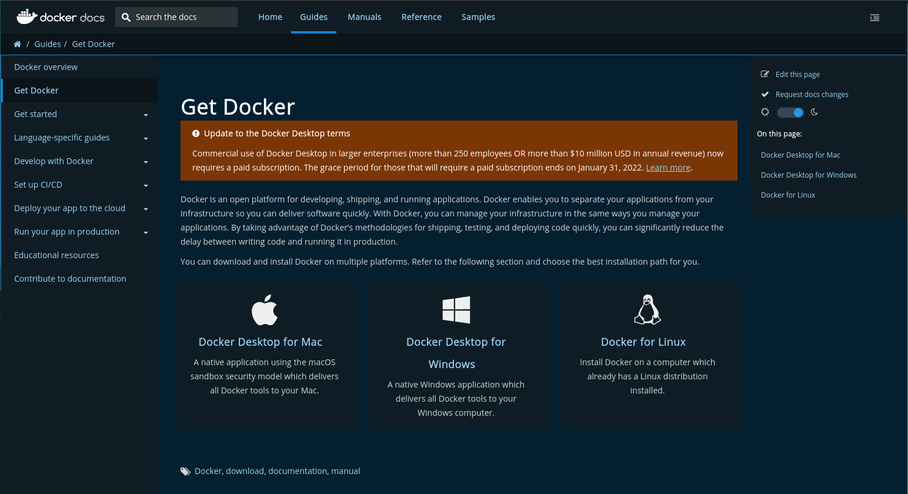

# D.U.N.E.
Docker Utilities for Node Execution


## Getting Started
First we must install [Docker](https://docs.docker.com/get-docker/).


Once you select the Docker Desktop for your operating system the installation process is very straight forward.

### Linux
They have both .DEB and .RPM packages available.  If you can't get these to work for some reason most repos have packages available for the engine and auxillary components.

When finished installing. Check the installation with the command 
```console
$ docker --help
```

This should display the list of commands and features.  If it fails with unknown command the installation did not work correctly.

#### `Python3`
Depending on the distro you are using will determine which python3 package to install.

| Distro | Package Name |
|--------|--------------|
| Ubuntu | python3 |
| RHEL   | rh-python36 * (need to use `scl enable rh-python36 bash`)| 
| Centos | python3 |
| Arch   | python |


#### `Add DUNE To Path`
To keep from having to install files to the users system, the perferred method of usage is to add this directory to your 'PATH'.
```console
$ echo "PATH=<LocationOfDUNE>:$PATH" >> .bashrc
```
## Scenarios
### Contract Development
